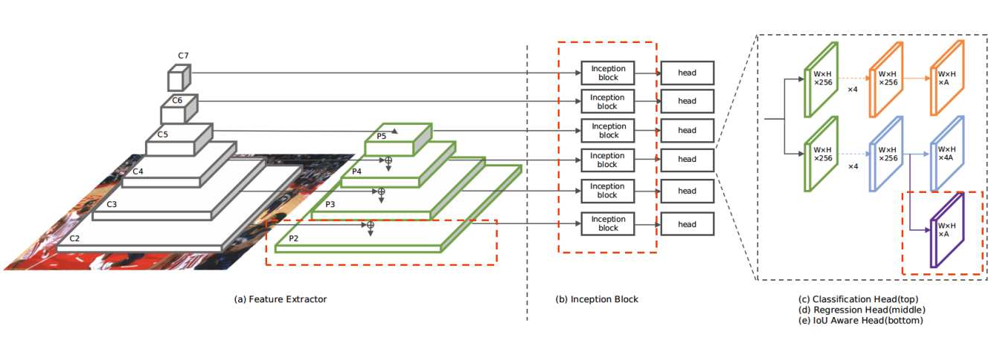

# Work In Process - TinaFace(2021)
- Here is the [Paper](https://arxiv.org/pdf/2011.13183.pdf) of the model
- I implement this model with TensorFlow version '2.6.0'

# Setup
- Download my data folder including image folders for train, validate and test also label in JSON format; unzip and put it at same level with model folder. [Dataset](https://drive.google.com/file/d/1hOWAulRkNtIqFgtMshI2_8SiE0pHeRwf/view?usp=sharing)

# Dataset
- My dataset is a small part of [WIDER FACE dataset](http://shuoyang1213.me/WIDERFACE/)
- My dataset consists 6 folders: 3 folder of image 3 folder of label corresponding each image
- I use Labelme application to annotate image by myself and you can get more detail [here](https://github.com/wkentaro/labelme)

# How this project works
- Input Pipeline: Transform raw image and bounding box coordinates in image to tensorflow dataset
    - After apply augmentation, I tranform image to 640x640x3 tensor
    - Because I don't know exactly the number of face in image so I create a "padded_bboxes" tensor with shape(100x4) then add bound box corrdinate tensor later
    
- Model:
    - ResNet50 --> FCN --> Inception --> Head
        - From C2 -> C3 -> C4 -> C5, the size of block reduce respectively 160x160 -> 80x80 -> 40x40 -> 20x20 
        - ResNet50 block use to get the overview of image but ignore detail
        - ResNet50 combine FCN in order to get both detail and overview of the image
        - Inception block help model to capture objects as well as context at multiple scale

    - I simplify model when compare with model architecture in paper by reducing 7 levels to 5 levels in Resnet50. The deeper Resnet50 is the better model can detect close face. This is the first version so I will update model later. 

- Target Assigner: Transform raw image with bounding box coordinates to heads
    - Architecture of head for each level:
        - Classification head
        - Regression head
        - IoU Aware head

# Model Architecture

# Training 
- Working on

